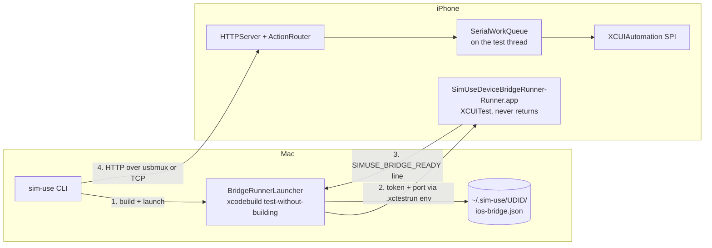

# Real iOS device support via an on-device XCUITest bridge

Work record for adding real-iPhone / real-iPad support to sim-use, as the
counterpart to the Android `sim-use-device-bridge` APK.

## The constraint that shapes everything

The Android bridge works because Android publishes `AccessibilityService`: with
the user's consent, an ordinary installed app can read another app's view tree
and dispatch gestures. Package it as an APK, install it once, talk to it over
`adb forward`, done.

**iOS has no equivalent.** No entitlement available to a third-party app grants
cross-app accessibility reads or synthetic touch injection. The only process on
a non-jailbroken device that has them is one `testmanagerd` is supervising — an
XCUITest runner — and it has them only while its test method is executing.

So the iOS counterpart of the APK is not an app. It is a UI-test bundle whose
single test starts an HTTP server and never returns, with the host holding an
`xcodebuild test-without-building` process open for the session. This is the
same design WebDriverAgent has used since 2015, arrived at from the same dead
end.

## The design win: reuse the Simulator's tree shape

`/a11y_tree_full` returns an array of iOS accessibility elements with exactly
the fields idb returns for the Simulator (`type`, `frame`, `children`,
`enabled`, `AXLabel`, `AXUniqueId`, `AXValue`) rather than inventing a
device-specific schema or reusing Android's `ElementNode`.

That single decision means `OutlineFormatter`, `ListDetector`,
`AccessibilityTargetResolver`, `OutlineCache`, and every `@N` / `#N` alias work
on a real phone with no new normalizer code — and, more importantly, that the
outline a user or an agent reads is byte-comparable between a simulator and a
device. `iOSDeviceBackend` depends on `iOSSimBackend` purely to reuse that
stack.

One nicety falls out of it: the bridge knows the foreground bundle id
first-hand and returns it alongside the tree, so `ForegroundLabel.reconcile`
gets an authoritative answer. The Simulator path has to recover it from the AX
root's pid via launchctl, which is why that path can disagree with what is
actually on screen (issue #81) and this one cannot.

## Things that had to be discovered on the device

### Event submission moved, and fails loudly

The first cut called `-[XCUIDevice performDeviceEvent:error:]`, which is what
the **macOS** slice of `XCUIAutomation.framework` advertises. On iOS that
selector exists but internally sends `-duration` to the event record — which
`XCSynthesizedEventRecord` does not implement on iOS. The result was
`NSInvalidArgumentException`, which unwound out of the test method and killed
the entire bridge session: `/button home` succeeded, then every subsequent
request timed out with no error anywhere the user could see.

Two fixes, both load-bearing:

1. `SimUseSubmitEvent` tries `-[XCSynthesizedEventRecord synthesizeWithError:]`
   (the working iOS route) first, then `eventSynthesizer` +
   `synthesizeEvent:completion:` (WebDriverAgent's), then
   `performDeviceEvent:error:` last.
2. **Every handler runs inside `SimUseExceptionTrap`.** Swift cannot catch
   `NSException`; without the trap any raise anywhere in a handler ends the
   session. Now it becomes a 500 and the bridge stays up.

The lesson generalises: introspecting the macOS framework is convenient but not
authoritative. The iOS binary's ObjC metadata (`otool -oV`) is.

### `/diag` exists because of this

The version-sensitive surface is small but real —
`XCUISystem.activeForegroundApplications` in particular has changed element
type across Xcode releases. `GET /diag` reports, from the device, what actually
resolved and what `activeForegroundApplications` returned. That turns "an Xcode
upgrade broke the bridge" from a rebuild-and-guess loop into one request.

### A locked phone is a hard stop

`xcodebuild` does not fail on a locked device; it sits in a retry loop printing
"Unlock … to Continue". The launcher watches for that and converts it into an
actionable error instead of a three-minute timeout.

## Host-side decisions worth recording

**usbmux without a forwarding process.** `adb forward` works for a one-shot CLI
only because the adb *server* outlives the command. There is no equivalent for
iOS, and a `sim-use` invocation has nowhere to keep an `iproxy` alive. Instead
`USBMuxTransport` dials `/var/run/usbmuxd` per request: `ListDevices` to map
UDID → device id, `Connect` to open the port, and the same socket then *is* the
TCP stream. No listener, no lifecycle, ~1 ms. Wi-Fi falls back to a plain TCP
connection to an address the runner advertised on its ready line.

**The token flows the other way.** On Android the app mints the bearer token and
`adb shell content query` fetches it through a ContentProvider. A test runner
has no inbound channel, so the host mints it and injects it into the runner's
environment by patching the `.xctestrun` before launch. That removes an entire
IPC surface — and the token never has to be persisted on the phone.

The `.xctestrun` is patched **in place**: `__TESTROOT__` resolves relative to
the file's own directory, so a patched copy elsewhere points at products that
are not there. (Found the hard way; the first attempt copied it to a scratch
directory and got "Missing test product".)

**Refusing beats degrading.** Live AX selectors (`--label`, `--id`,
`--element-type`) work on the Simulator by re-querying and hit-testing at tap
time. The bridge has no point-query endpoint, so honouring them would mean
silently falling back to the last `describe-ui` snapshot. On a real phone a
wrong tap is not recoverable the way it is on a simulator, so
`IOSDeviceTargeting` raises and points at the `@N` alias instead.

## A latent bug this surfaced

`PlatformRouter` classified real-device UDIDs as Android serials. The modern
form `00008150-000E242411D9401C` is 25 characters of hex and one dash — inside
adb's 4–32 length window, passing its character filter, containing digits. Any
pre-existing command handed a real iPhone's UDID would have gone to `adb`.
Real-device shapes are now matched before the Android heuristic, pinned by
`IOSDevicePlatformRoutingTests`.

## Deliberate scope boundaries

Not implemented, each for a specific reason rather than time:

| Verb | Why |
|---|---|
| `gesture`, `multi-touch` | The bridge's `/gesture` endpoint works; what is missing is host-side translation of the preset vocabulary (pinch/rotate/zoom) into strokes for this backend. |
| `touch` | Exposes raw down/move/up phases. The synthesized-event API delivers a whole gesture atomically and cannot hold a touch open across CLI invocations. |
| `record-video` | Needs the device screen-recording service — a different code path from anything the bridge does. |
| AX selectors | See "Refusing beats degrading" above. |

## What live testing changed

Two things only a real device could have told us.

### A third-party keyboard is invisible to the accessibility tree

`keyboard-state` reported `hidden` while the keyboard was plainly on screen.
The screenshot settled it: Spotlight focused, a third-party IME (蝦米輸入法) up,
and *zero* `Keyboard` or `Key` elements in either Spotlight's or SpringBoard's
tree. A keyboard extension runs in its own process and contributes nothing to
the host app's snapshot, so the original snapshot-walk detection could not have
worked for it in principle.

The fix is a ladder of four independent signals (`query` → `snapshot` → `keys`
→ `focus`), with the answer reported back in `detection`. The one that saves
the case is `focus`: a focused text input proves a keyboard is up without
needing to see any of its elements — and we already knew focus was present,
because `type` had successfully landed text in that very field. `focus` cannot
report a frame, so the CLI says `soft (bounds unknown — out-of-process keyboard
extension)` rather than implying geometry it does not have.

Worth noting for the next person: the first probe that suggested this bug was
contaminated — the phone's owner had switched apps mid-test. The rule that
saved a wrong fix was to re-run the whole sequence in one tight command and get
visual ground truth before touching code.

### The build cache could serve a stale runner

`buildDirectory` keyed on (project path, team, Xcode version). Editing a
handler and re-running `init` therefore reused the previous build and relaunched
the *old* runner — the change would appear not to work, with nothing in the
output to explain why. The key now includes a content fingerprint of the bridge
sources.

## Verification status

Verified live on an iPhone 17 Pro (iOS 27.0, Xcode 26.3, network transport),
end-to-end through the CLI:

| Path | Result |
|---|---|
| `ios-device init` (build → sign → launch → ready → ping) | ✅ incl. cache reuse on second run |
| `ios-device status` / `stop` | ✅ clean teardown, no orphaned process |
| `describe-ui` | ✅ shared renderer, `@N` aliases, region headers, `#id`s |
| `tap @N` (alias → outline cache → event) | ✅ and **the session survived**, which is the `synthesizeWithError:` fix |
| `swipe` | ✅ both directions |
| `/gesture` two-finger multi-stroke | ✅ |
| `type` | ✅ text landed in the target field |
| `screenshot` (+ on-device downsample) | ✅ |
| `button home` | ✅ |
| top-level routing (`sim-use tap --device <real udid>`) | ✅ — also confirms the PlatformRouter fix |
| `keyboard-state` | ❌ → fixed (see above), **not yet re-verified on device** |
| `paste` | not exercised — needs a text field the tester is willing to paste into |

The keyboard-detection ladder and the cache-key fix compile and pass unit
tests but have not been through a device run; both are the first things to
re-check on the next live session. Because the cache key now covers source
contents, that session will rebuild the runner automatically — no `--rebuild`
needed.

### Privacy note

Testing ran against the owner's personal phone, which put real app content
(LINE) on screen. Screen dumps stopped as soon as that was apparent, and the
remaining checks were chosen to avoid reading personal content: geometry-only
screenshot checks, Spotlight rather than a messaging app for text entry, and
`/diag` (bundle ids only) instead of tree dumps. Worth keeping as the default
posture for real-device work — a simulator has no such constraint, a personal
phone does.
